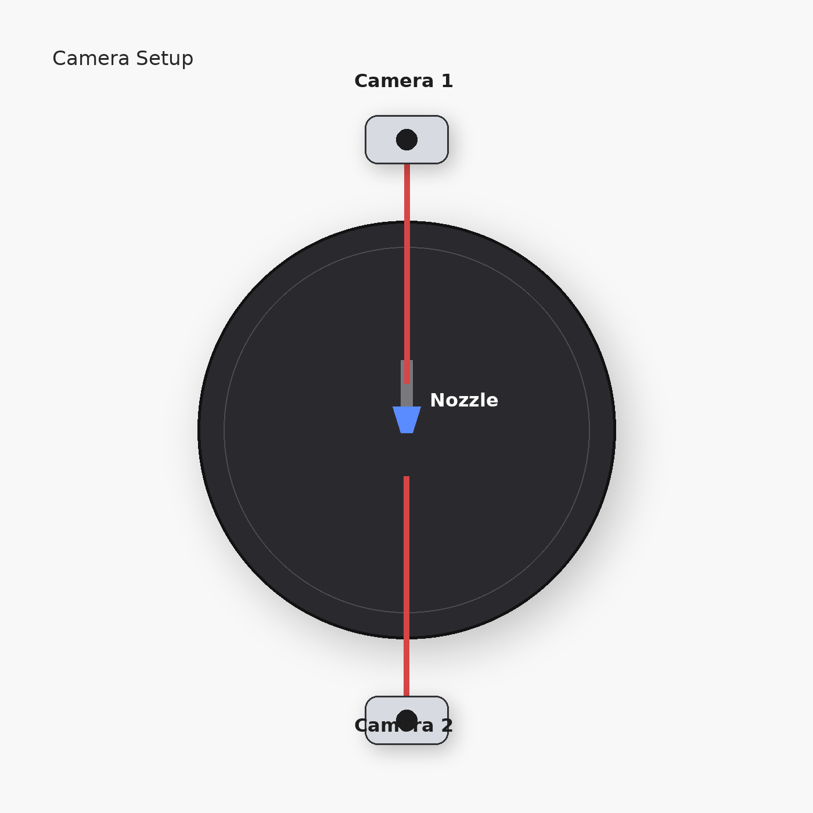
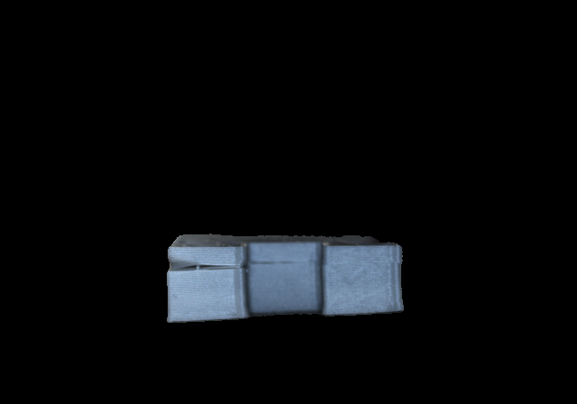

<div align="center">

# Embedded Vision for Real-Time 3D Printing Defect Detection

### Edge AI · Computer Vision · Quantized Deployment · Additive Manufacturing

<p align="center">
  
</p>

Lightweight embedded defect detection system for extrusion-based additive manufacturing using:
YOLO11n, dual-camera monitoring, ROI optimization, segmentation experiments, quantized edge inference, and real-time deployment on embedded AI hardware.

</div>

<br>

# Overview

| Component | Description |
|---|---|
| Detection Model | YOLO11n |
| Deployment Target | Embedded AI Camera + Raspberry Pi |
| Target Defects | Stringing · Cracking · Warping |
| Quantization | PTQ (Post-Training Quantization) |
| Monitoring Setup | Dual-camera 180° nozzle coverage |
| Optimization | ROI-based OpenCV preprocessing |
| Additional Experiments | SAM2 · U-Net · GPTQ · QAT |
| Printing Context | Multi-axis additive manufacturing |

<br>

# Why This Project Exists

Multi-axis and supportless additive manufacturing introduces highly unstable print conditions where failures can appear dynamically during extrusion.

Traditional post-process inspection is often too late:
- wasted material
- failed prints
- long manufacturing cycles
- inconsistent quality

This project explored whether lightweight embedded computer vision systems could perform:

<table>
<tr>
<td align="center">

# Real-Time In-Situ Defect Detection

directly on constrained edge hardware during active printing

</td>
</tr>
</table>

The work focused specifically on detecting:

| Defect | Description |
|---|---|
| Stringing | Unwanted filament strands during travel |
| Cracking | Structural separation between layers |
| Warping | Edge lifting caused by thermal deformation |

<br>

# Target Defects

<p align="center">
  
  
  
</p>

The dataset was intentionally generated using:
- custom STL geometries
- extrusion parameter variation
- unstable print conditions
- thermal manipulation
- controlled failure generation

to create realistic additive manufacturing defects.

<br>

# System Pipeline

<p align="center">
  
</p>

| Stage | Function |
|---|---|
| Image Acquisition | Embedded dual-camera capture |
| ROI Extraction | OpenCV-based preprocessing |
| Edge Inference | Quantized YOLO11n inference |
| Localization | Real-time defect detection |
| Monitoring | Live additive manufacturing inspection |

<br>

# Dual-Camera Monitoring Setup

<p align="center">
  
</p>

Two identical AI cameras were positioned approximately 180° apart around the print nozzle to reduce nozzle occlusion and improve monitoring coverage during active printing.

The dual-view setup improved:
- visibility around the extrusion region
- defect consistency tracking
- detection reliability
- monitoring coverage during long-duration prints

<br>

# Dataset Samples

<p align="center">
  
  
  
</p>

<p align="center">
  
  
  
</p>

The dataset combined:
- custom generated failures
- manually captured print defects
- controlled environmental variation
- augmentation pipelines
- public additive manufacturing datasets

<br>

# Detection Results

<p align="center">
  
</p>

Real-time YOLO11n inference successfully detected:
- warping
- stringing
- cracking

during active additive manufacturing.

The lightweight deployment pipeline maintained stable inference while operating under constrained embedded hardware conditions.

<br>

# Embedded Deployment

<p align="center">
  
</p>

| Deployment Feature | Result |
|---|---|
| Inference Speed | 15–20 FPS |
| Resolution | 720×1080 |
| Deployment Type | Quantized Edge Inference |
| Preprocessing | ROI-based OpenCV pipeline |
| Hardware | Embedded AI Camera + Raspberry Pi |

<br>

# ROI Optimization

A major engineering challenge involved reducing computational load during embedded inference.

Initial hardware ROI approaches produced unstable inference behavior.

To solve this, a software ROI preprocessing pipeline was implemented using OpenCV before inference execution.

<table>
<tr>
<td>

### ROI Pipeline Improvements

- Reduced background interference
- Improved detection stability
- Reduced false positives
- Improved real-time throughput
- Lower embedded compute overhead

</td>
</tr>
</table>

<br>

# Model Exploration

| Category | Models Explored |
|---|---|
| Detection | YOLO11n · YOLOv9 · DETR |
| Lightweight CNNs | MobileNetV3 · EfficientNet |
| Segmentation | U-Net · SAM2 |
| Optimization | PTQ · GPTQ · QAT |

Several lightweight architectures were explored before final deployment selection.

YOLO11n provided the best balance between:
- inference speed
- deployment stability
- model size
- embedded compatibility
- real-time performance

<br>

# Quantization and Model Conversion

A significant portion of the project involved converting standard deep learning models into formats compatible with constrained embedded AI hardware.

The workflow included:
- ONNX export
- model optimization
- quantization
- embedded compilation
- deployment packaging
- edge validation

<br>

| Quantization Technique | Status |
|---|---|
| PTQ | Final Deployment |
| GPTQ | Experimental |
| QAT | Experimental |

<br>

Final deployment used:

<table>
<tr>
<td align="center">

# PTQ (Post-Training Quantization)

because it provided the best balance between:
deployment simplicity, model stability, accuracy retention, and embedded compatibility.

</td>
</tr>
</table>

The final optimized deployment package remained approximately:

# ~6 MB

which enabled successful deployment on embedded AI hardware.

<br>

# Segmentation Experiments

<p align="center">
  
  
  
</p>

<p align="center">
  
  
</p>

Segmentation-based pipelines were explored for:
- foreground isolation
- pixel-level defect localization
- geometry-aware inspection
- defect region extraction

Although segmentation quality was promising, deployment proved impractical because of:
- embedded memory constraints
- quantization degradation
- unstable multi-model inference
- segmentation overhead on constrained hardware

<br>

# Training Performance

<p align="center">
  
</p>

Training converged consistently with stable validation behavior across all defect classes.

<br>

| Metric | Value |
|---|---|
| Precision | 0.785 |
| Recall | 0.870 |
| mAP@0.5 | 0.888 |
| mAP@0.5:0.95 | 0.476 |

<br>

# Real-Time Corrective Feedback Experiments

The project also explored whether detected defects could be corrected automatically during active printing using adaptive ML-based feedback systems.

The objective was to dynamically modify:
- print speed
- extrusion behavior
- feed rate
- thermal conditions

after defect detection.

However, autonomous correction proved unreliable because of:
- unstable material behavior
- environmental variability
- thermal fluctuations
- inconsistent extrusion dynamics
- nozzle contamination
- unpredictable defect progression

Although the closed-loop correction pipeline was unsuccessful, the experiments provided valuable insights into the limitations of adaptive embedded manufacturing systems.

<br>

# Engineering Challenges

<table>
<tr>
<td>

### Major Challenges Encountered

- Embedded memory limitations
- Segmentation deployment instability
- Quantization accuracy degradation
- Real-time inference constraints
- Environmental variability during printing
- Nozzle occlusion
- Multi-camera synchronization
- Hardware deployment restrictions
- Adaptive feedback instability

</td>
</tr>
</table>

This repository intentionally documents both:
- successful deployment pipelines
- failed experimental approaches

because both were critical to the engineering and research process.

<br>

# Repository Structure

```text
embedded-vision-3d-print-monitoring/
│
├── assets/
│   ├── camera_setup/
│   ├── dataset_samples/
│   └── results/
│       ├── deployment/
│       ├── segmentation/
│       └── training/
│
├── embedded_vision_system/
├── experiments/
├── model_conversion/
├── README.md
├── requirements.txt
└── .gitignore
```

<br>

# Future Work

| Direction | Goal |
|---|---|
| Multi-model edge deployment | Simultaneous detection + segmentation |
| Temporal tracking | Defect progression analysis |
| Lightweight segmentation | Embedded deployment feasibility |
| Multi-view fusion | Improved nozzle visibility |
| Autonomous correction | Real-time adaptive printing |
| Hardware acceleration | Higher FPS and lower latency |

<br>

# References

| Topic | Reference |
|---|---|
| Additive Manufacturing | Wickramasinghe et al. |
| In-Situ Defect Detection | An et al. |
| Closed-Loop Monitoring | Liu et al. |
| U-Net Segmentation | Ronneberger et al. |
| Segment Anything | Kirillov et al. |
| YOLO Architectures | Redmon et al. |
| MobileNetV3 | Howard et al. |
| DETR | Carion et al. |
