<div align="center">

# Embedded Vision for Real-Time 3D Printing Defect Detection

### Edge AI · Embedded Vision · Quantized Inference · Additive Manufacturing

<p align="center">
  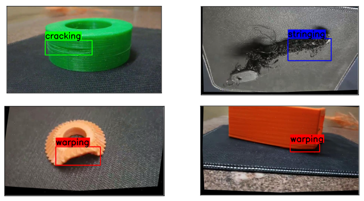
</p>

Lightweight embedded computer vision system for real-time defect detection in extrusion-based additive manufacturing using dual-camera monitoring, quantized deep learning models, ROI optimization, and edge AI deployment.

</div>

<br>

# Research Motivation

Additive manufacturing failures often become visible only after significant material and time have already been wasted.

In multi-axis extrusion systems, these failures become even more difficult to monitor because:
- nozzle movement introduces occlusion
- thermal conditions continuously change
- extrusion instability evolves dynamically
- supportless geometries create unpredictable print behavior

This project explored whether lightweight embedded vision systems could perform:

<table>
<tr>
<td align="center">

# Real-Time In-Situ Defect Detection

directly during active printing on constrained edge hardware

</td>
</tr>
</table>

The work was conducted as part of a broader multi-axis additive manufacturing research platform focused on supportless printing and intelligent monitoring.

<br>

# Target Defects

The system focused specifically on detecting three major extrusion-related failures:

| Defect | Description |
|---|---|
| Stringing | Unwanted filament strands between travel regions |
| Cracking | Layer separation and structural discontinuities |
| Warping | Thermal deformation causing edge lifting |

<br>

<p align="center">
  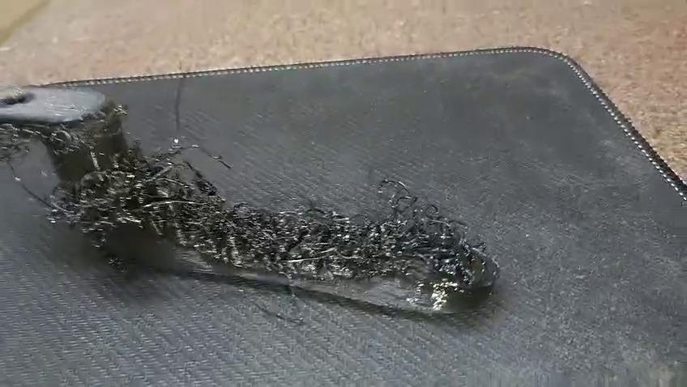
  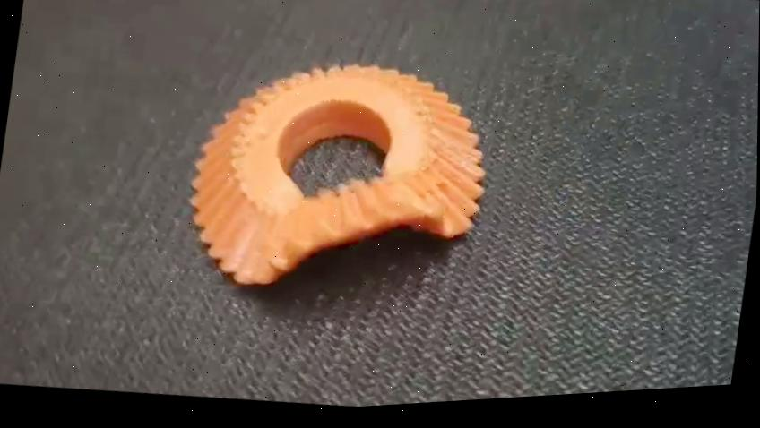
  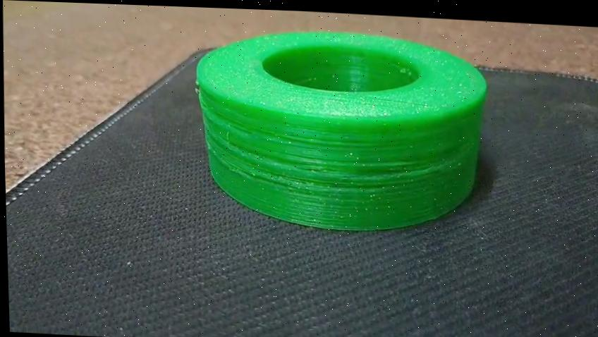
</p>

<br>

# Dual-Camera Embedded Monitoring Setup

<p align="center">
  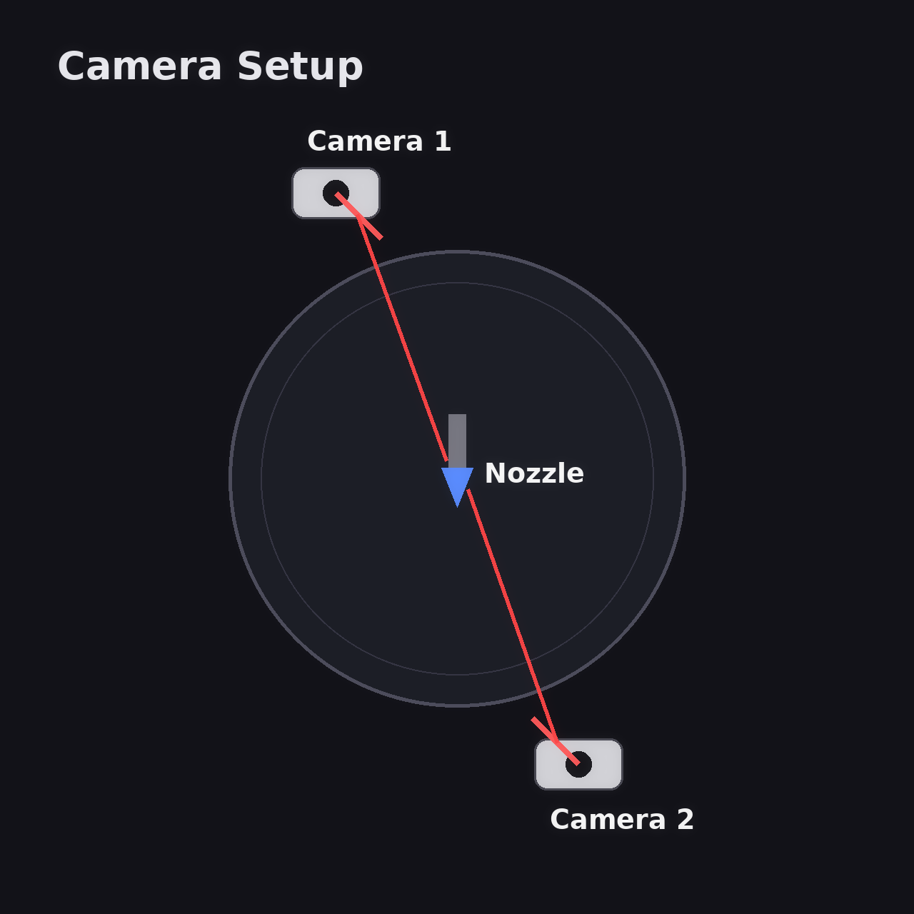
</p>

Two identical AI cameras were mounted approximately 180° apart around the nozzle region to reduce visual occlusion during printing.

The setup enabled:
- front and rear print visibility
- improved monitoring coverage
- reduced blind spots
- complementary defect validation
- better observation around the extrusion zone

The cameras alternated using a hardware multiplexer to provide multi-view monitoring while remaining within embedded processing limits.

<br>

# Dataset Generation

Unlike standard vision datasets, defect generation in additive manufacturing is highly inconsistent and difficult to reproduce reliably.

A custom dataset pipeline was developed using:

| Dataset Source | Purpose |
|---|---|
| Custom STL models | Artificial defect generation |
| Thermal manipulation | Warping generation |
| Extrusion parameter variation | Process instability |
| Controlled print failures | Real-world defect simulation |
| Public AM datasets | Additional defect diversity |
| Manual annotation | Bounding-box supervision |
| Data augmentation | Generalization improvement |

<br>

<p align="center">
  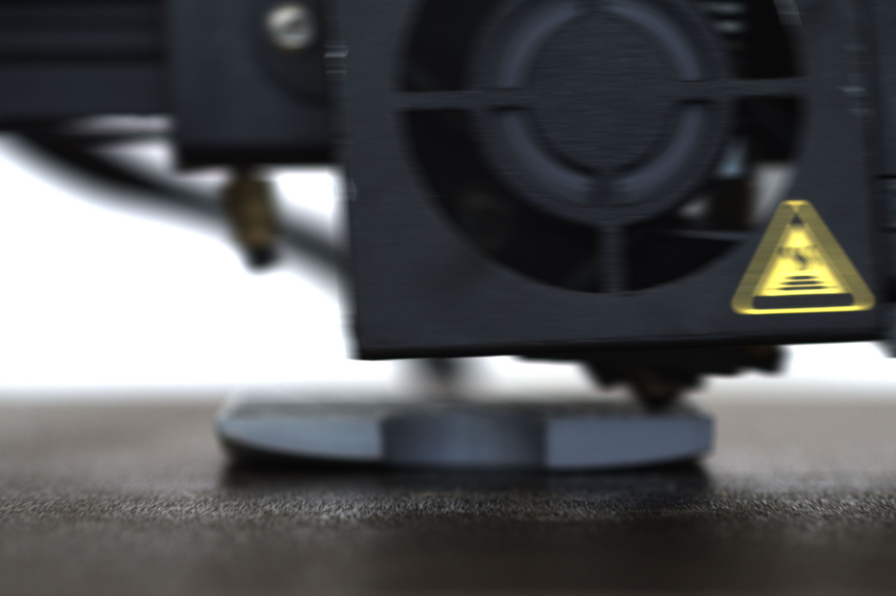
  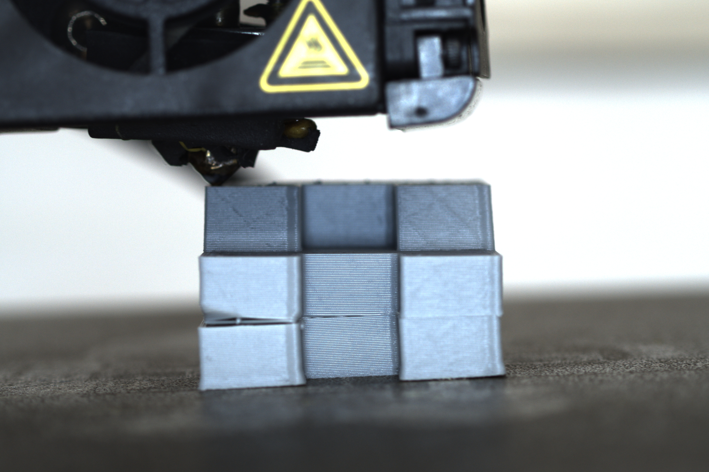
  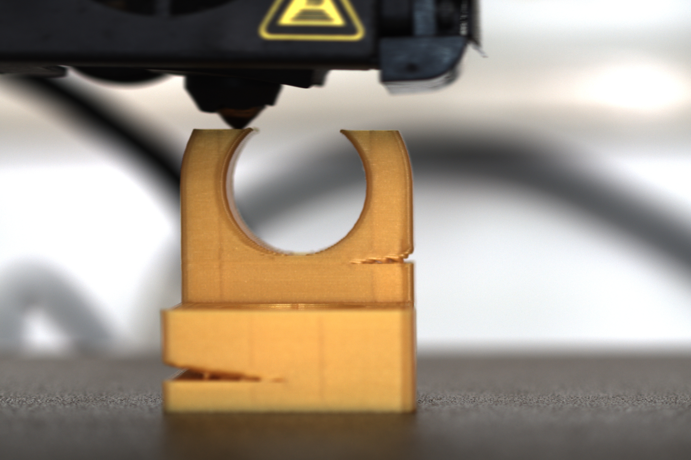
</p>

<p align="center">
  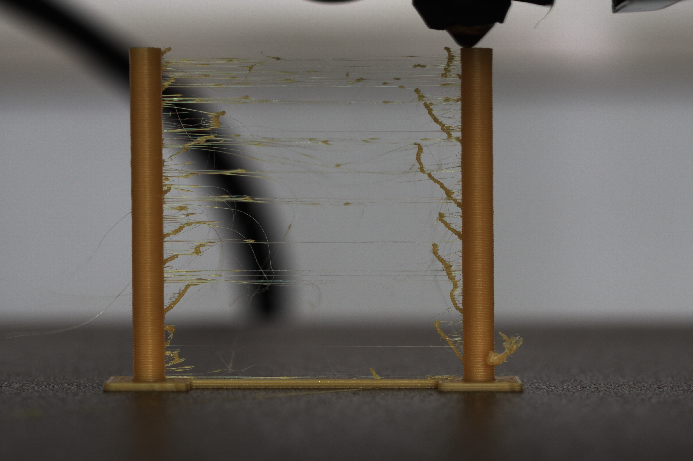
  
  
</p>

The experiments revealed that generating repeatable manufacturing defects through parameter tuning alone was significantly harder than expected.

Only stringing defects could be reproduced consistently through slicing modifications, while cracking and warping required additional geometric and thermal manipulation strategies.

<br>

# Embedded Detection Pipeline

<p align="center">
  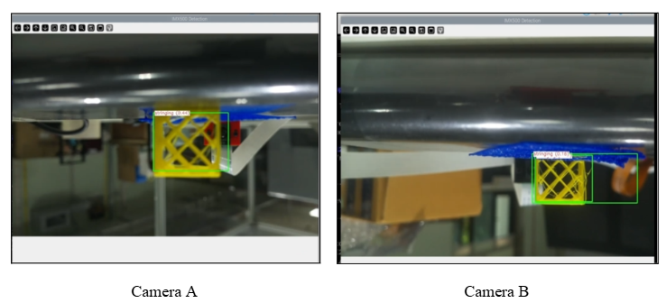
</p>

| Pipeline Stage | Function |
|---|---|
| Dual Camera Capture | Embedded image acquisition |
| ROI Extraction | OpenCV preprocessing |
| Quantized Inference | Edge AI execution |
| Defect Localization | Real-time detection |
| Live Monitoring | Active manufacturing inspection |

<br>

# Detection Model Selection

Several lightweight architectures were evaluated for embedded deployment compatibility.

| Category | Models Explored |
|---|---|
| Detection | YOLO11n · YOLOv8n · DETR |
| Lightweight CNNs | MobileNetV3 · EfficientNet |
| Segmentation | U-Net · SAM2 |
| Optimization | PTQ · GPTQ · QAT |

The primary challenge involved balancing:
- inference speed
- memory usage
- deployment compatibility
- detection accuracy
- real-time performance

YOLO11n was ultimately selected because it achieved the best tradeoff between:
- stable deployment
- embedded compatibility
- compact model size
- real-time inference
- defect detection accuracy

The final deployment package remained approximately ~6 MB after optimization and quantization, allowing successful embedded deployment within hardware limits.

<br>

# Quantization and Model Conversion

A major portion of the research involved converting standard deep learning models into deployable embedded inference pipelines.

The deployment workflow included:

| Stage | Description |
|---|---|
| ONNX Export | Cross-platform conversion |
| Quantization | Reduced memory footprint |
| Optimization | Embedded inference tuning |
| Packaging | Edge deployment generation |
| Validation | Hardware-side testing |

<br>

Multiple quantization strategies were explored:

| Technique | Status |
|---|---|
| PTQ (Post-Training Quantization) | Final Deployment |
| GPTQ | Experimental |
| QAT | Experimental |

<br>

<table>
<tr>
<td align="center">

# PTQ (Post-Training Quantization)

was finalized because it provided the best balance between:
model stability, deployment simplicity, accuracy retention, and embedded compatibility.

</td>
</tr>
</table>

<br>

# ROI-Based Optimization

One of the largest deployment challenges involved reducing inference overhead on constrained embedded hardware.

Initial hardware ROI attempts produced unstable detection behavior and inconsistent bounding-box generation.

To overcome this, a software-based ROI preprocessing pipeline was implemented using OpenCV before inference execution.

<br>

| ROI Optimization Benefits |
|---|
| Reduced background interference |
| Lower computational overhead |
| Improved real-time stability |
| Reduced false positives |
| Better embedded throughput |

<br>

# Segmentation Research

The project also explored segmentation-based pipelines for:
- pixel-level defect localization
- foreground isolation
- geometry-aware monitoring
- print-region extraction

<br>

## SAM2-Based Segmentation Experiments

<p align="center">
  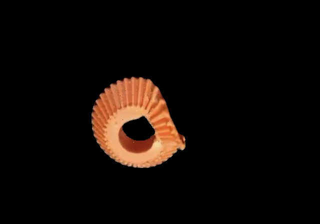
  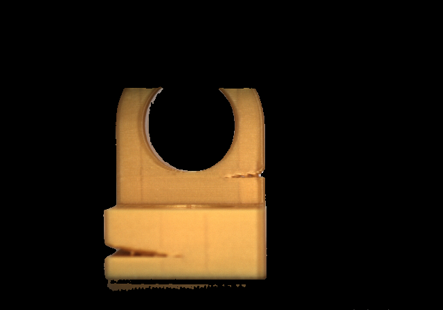
</p>

SAM2-based segmentation produced strong visual isolation quality during experimentation.

However, SAM2 proved too computationally expensive for stable embedded deployment because of:
- extremely high memory usage
- heavy model weights
- unstable inference performance
- embedded thermal limitations
- multi-model deployment overhead

As a result, SAM2 could not be deployed reliably on Raspberry Pi hardware for real-time inference.

<br>

## Lightweight U-Net Segmentation

To reduce segmentation overhead, a lightweight attention-based U-Net architecture was explored.

<p align="center">
  
</p>

The architecture used:
- encoder-decoder segmentation
- attention blocks
- lightweight skip connections
- embedded-oriented feature extraction

to improve deployment feasibility under constrained hardware conditions.

<br>

## U-Net Segmentation Results on Raspberry Pi

<p align="center">
  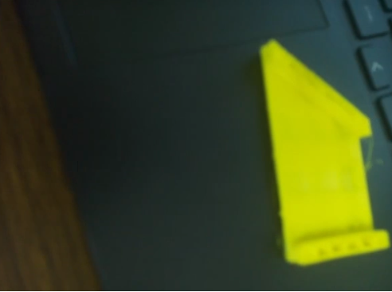
  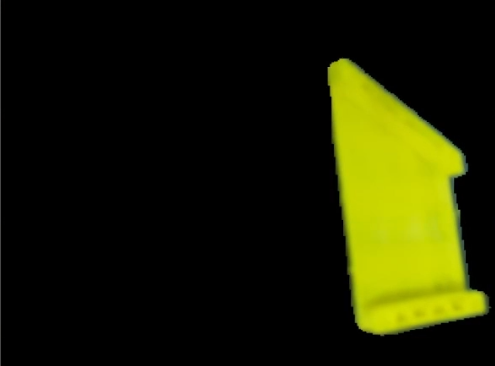
</p>

The optimized lightweight U-Net pipeline was successfully deployed and executed on Raspberry Pi hardware.

The segmentation pipeline enabled:
- foreground isolation
- print-region extraction
- geometry-aware monitoring
- reduced background interference

The optimized deployment required:
- lightweight architecture tuning
- quantization
- embedded inference optimization
- preprocessing improvements

Although feasible, segmentation still introduced additional computational overhead during long-duration real-time deployment.

<br>

## Combined Segmentation + Detection Pipeline

A combined segmentation-detection pipeline was also explored.

<p align="center">
  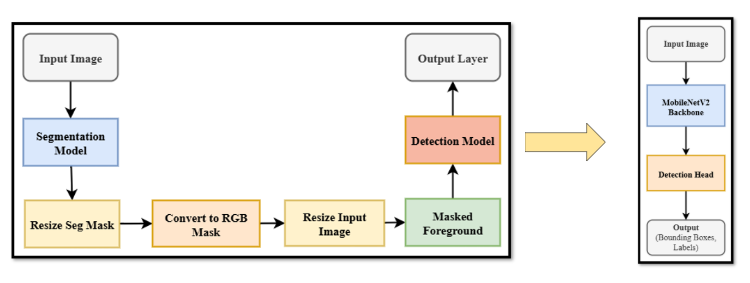
</p>

The idea was:
1. segment the print object
2. isolate foreground regions
3. perform detection only inside segmented regions

This significantly improved visual focus during experimentation.

The integrated pipeline was successfully deployed using simultaneous lightweight segmentation and detection models on embedded hardware after:
- quantization
- pruning
- optimization attempts

Although feasible, the combined system still introduced additional:
- memory overhead
- inference latency
- scheduling complexity
- thermal load

These experiments highlighted both the feasibility and practical limitations of simultaneous multi-model deployment on constrained edge hardware.

<br>

# Detection Results

<p align="center">
  
</p>

The deployed system successfully detected:
- cracking
- stringing
- warping

during active printing with stable real-time inference.

<br>

# Embedded Deployment Results

<p align="center">
  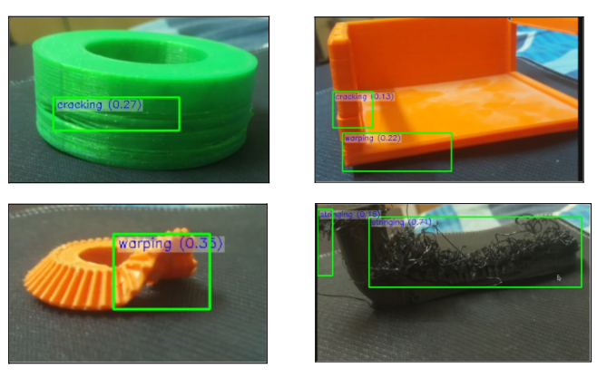
</p>

| Deployment Metric | Result |
|---|---|
| Inference Speed | 15–20 FPS |
| Resolution | 720×1080 |
| Deployment Mode | Quantized Edge Inference |
| Preprocessing | ROI-based OpenCV |
| Runtime System | Raspberry Pi + AI Camera |

<br>

# Training Performance

<p align="center">
  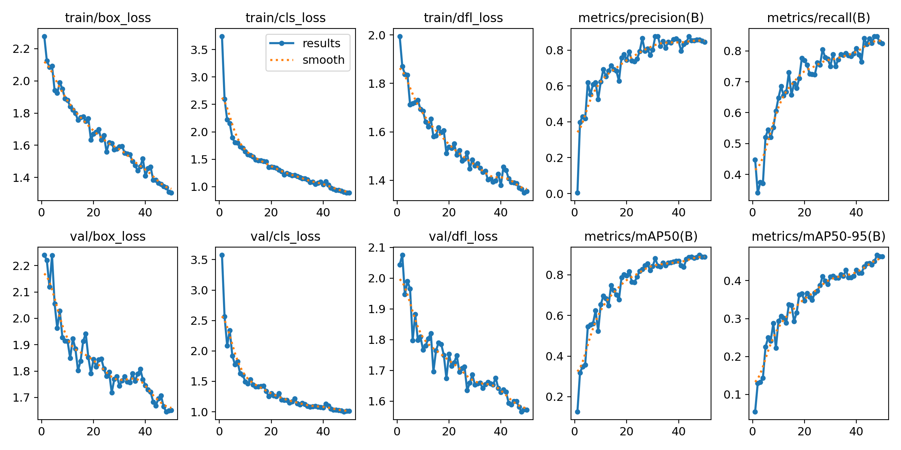
</p>

| Metric | Value |
|---|---|
| Precision | 0.785 |
| Recall | 0.870 |
| mAP@0.5 | 0.888 |
| mAP@0.5:0.95 | 0.476 |

The model achieved stable convergence and maintained reliable detection performance across all three defect classes.

<br>

# Real-Time Corrective Feedback Experiments

Beyond defect detection, the project also explored adaptive feedback systems intended to modify printing behavior dynamically during active manufacturing.

The objective was to automatically adjust:
- extrusion behavior
- print speed
- thermal conditions
- feed rate
- material flow

after defect detection.

However, closed-loop correction proved unreliable because of:
- thermal instability
- environmental fluctuations
- inconsistent extrusion dynamics
- nozzle contamination
- unpredictable defect evolution
- real-world material variability

Although the adaptive correction pipeline was ultimately unsuccessful, these experiments provided valuable insight into the limitations of intelligent closed-loop additive manufacturing systems.

<br>

# Key Engineering Challenges

| Challenge | Impact |
|---|---|
| Embedded memory limits | Restricted model complexity |
| Multi-model deployment | Increased inference complexity |
| Quantization degradation | Accuracy reduction |
| Nozzle occlusion | Reduced visibility |
| Environmental variability | Unstable defect behavior |
| Dual-camera synchronization | Embedded timing overhead |
| Real-time constraints | Deployment optimization complexity |

<br>

This repository intentionally documents:
- successful deployments
- failed experiments
- deployment limitations
- engineering tradeoffs

because all of them were critical to the research process.

<br>

# Repository Structure

```text
embedded-vision-3d-print-monitoring/
│
├── assets/
│   ├── camera_setup/
│   ├── dataset_samples/
│   ├── model_architecture/
│   └── results/
│       ├── deployment/
│       ├── segmentation/
│       └── training/
│
├── embedded_vision_system/
├── experiments/
├── model_conversion/
├── README.md
├── requirements.txt
└── .gitignore
```

<br>

# Future Work

| Research Direction | Objective |
|---|---|
| Temporal defect tracking | Analyze defect progression |
| Embedded segmentation optimization | Lightweight pixel-level inference |
| Multi-view fusion | Improved nozzle visibility |
| Closed-loop correction | Real-time adaptive manufacturing |
| Hardware acceleration | Higher FPS and lower latency |
| Autonomous defect analytics | Predictive manufacturing monitoring |

<br>

# References

| Topic | Reference |
|---|---|
| Additive Manufacturing | Wickramasinghe et al. |
| In-Situ Defect Detection | An et al. |
| Closed-Loop Monitoring | Liu et al. |
| U-Net Segmentation | Ronneberger et al. |
| Segment Anything 2 | Ravi et al. |
| YOLO Architectures | Redmon et al. |
| DETR | Carion et al. |
| MobileNetV3 | Howard et al. |